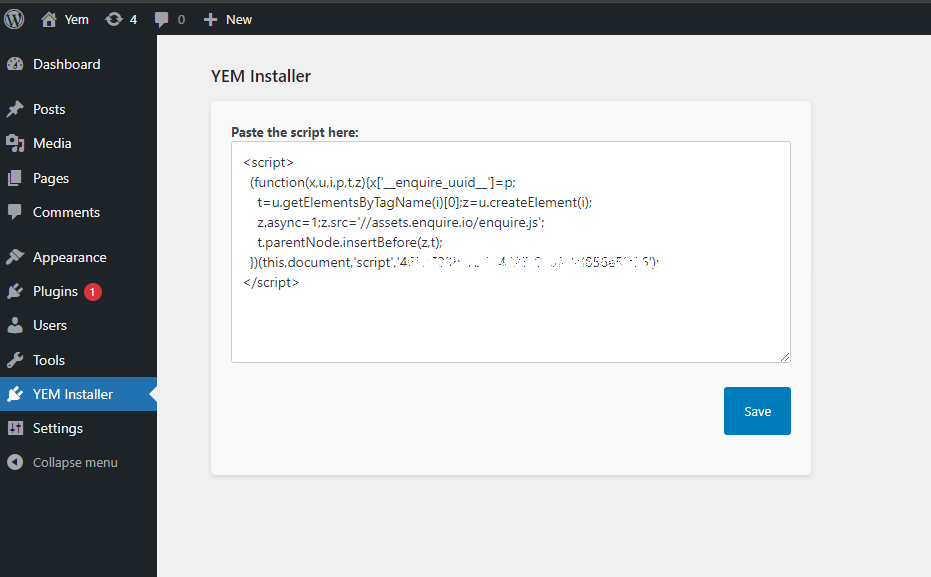

# YEM PRO Enquiry Tool

YEM Pro is FREEmium software that will help you gain more exposure, more enquiries, more sales and more referrals.

By simply adding YEM’s Enquiry tools to your website you are able to capture more enquiries of your anonymous website and visitors.

Instantly reply and manage your opportunities easily. 

# YEM Installer

YEM Installer is a WordPress plugin that allows you to easily insert script of YEM, into your WordPress site. This content will be included before the closing `</body>` tag on the frontend of your website.

## Description

YEM Installer is a user-friendly plugin designed to help you integrate YEM’s Enquiry tools into your WordPress site with minimal effort. Whether you want to add tracking codes, custom scripts, or any other YEM-related content, YEM Installer makes it simple and straightforward.

### Features

- Easily add the YEM script to your site.
- Simple and intuitive interface.
- Script is added just before the closing `</head>` tag on every page.
- Helps capture more enquiries from your website visitors.
- Enhances your ability to instantly reply and manage opportunities.

## Installation

1. Download the plugin ZIP file from the [latest release](https://github.com/Zeeshan0811/yem-installer/releases).
2. Upload the ZIP file to your WordPress site via the Plugins > Add New page.
3. Activate the YEM Installer plugin.

Alternatively, you can install the plugin directly from the WordPress Plugin Directory.

1. Go to the Plugins > Add New page in your WordPress admin dashboard.
2. Search for "YEM Installer".
3. Click "Install Now" and then "Activate".

## Usage

1. Once activated, navigate to the "YEM Installer" page in your WordPress admin dashboard.
2. Navigate to the YEM Installer page in your WordPress admin dashboard, and paste the YEM Pro script into the input box provided.
3. Click the "Save" button to save the content.
4. The content will be included before the closing `</head>` tag on the frontend of your website.

## Screenshots

1. **Admin Interface**: 
2. **Front Page**: 
3. **Enquiry Box**: 

## Frequently Asked Questions

### Where is the YEM script added?

The script you enter is added just before the closing `</head>` tag on every page of your site. This ensures that the script is loaded correctly and can capture enquiries from all pages.

### Can I add other types of code besides JavaScript?

Yes, while the primary use case for YEM Installer is to add the YEM Pro script (which is JavaScript), you can also add other types of HTML or CSS if needed.

### Is it safe to add scripts using YEM Installer?

Yes, but you should always be cautious when adding scripts to your site. Only add scripts from trusted sources to avoid potential security risks.

### Will the YEM script slow down my website?

The YEM script is designed to be lightweight and efficient. However, as with any additional scripts, there may be a minor impact on load times. It's important to test your site performance after adding any new scripts.

### Can I use YEM Installer on any WordPress theme?

Yes, YEM Installer is designed to work with any WordPress theme. The script is added before the closing `</head>` tag, ensuring compatibility with most themes.

### How do I update the YEM script if needed?

Simply navigate to the YEM Installer page in your WordPress admin dashboard, update the script in the input box, and click "Save". The new script will be applied immediately.

### What should I do if I encounter issues with the plugin?

If you encounter any issues, you can open a ticket in the [support forum](https://wordpress.org/support/plugin/yem-installer) or create an issue on GitHub. Additionally, you can check the plugin documentation and FAQ for troubleshooting tips.

## Changelog

### 1.0.0

- Initial release.

## Contributing

Contributions are welcome! If you find any issues or have suggestions for improvements, please open an issue or submit a pull request on GitHub.

## License

This project is licensed under the MIT License - see the [LICENSE](LICENSE) file for details.

## Support

If you need help, please open a ticket in the [support forum](https://wordpress.org/support/plugin/yem-installer) or create an issue on GitHub.
